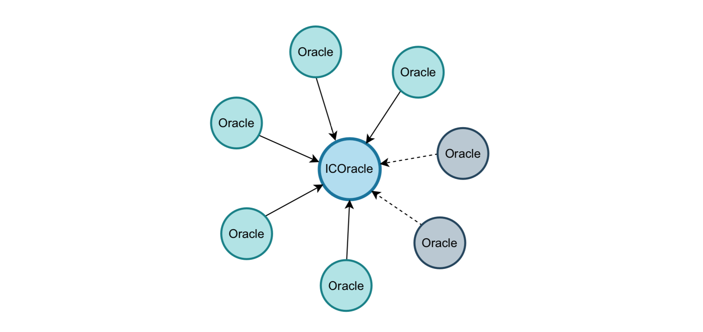

# ICOracle
A decentralized oracle protocol on IC blockchain.

Site: http://icoracle.io  
Twitter: https://twitter.com/icoracle_io  
Discord: https://discord.com/invite/6YXN7dxFQP

## Introduction

ICOracle is a decentralised oracle protocol on the IC blockchain that provides secure and reliable data for Dapps, integrating access to on-chain data, real-world data and off-chain computation while maintaining the inherent decentralised nature of blockchain technology. 

## Features

- **Secure and reliable network**

    Connect highly accurate and available data to any canister using decentralised, on-chain providers (with off-chain nodes as an aid), quality data and multi-data source consensus.

- **Seamless connection to any data**

    Build on a flexible framework that can retrieve data from any data sources (canisters, https outcalls, off-chain nodes), and integrate with any on-chain or off-chain data.

- **Maturing solutions**

    Many time-tested oracle solutions already exist in the Web3 space, and more will emerge on the IC network to help developers build market-leading decentralised applications.

- **Highly automation**

    ICOracle can be implemented almost 100% on-chain with the IC network, mitigating risk of manual interventions and centralized servers. Only in rare cases is it necessary for off-chain nodes to be involved in the work.

## How it works

ICOracle receives on-chain data by cross-canister calls, or receives off-chain data by https outcalls (or node pushes)  and consensus to form deterministic data. The datasets can be queried by Dapps via interface calls. There is an Events Canister for receiving event subscriptions and sending notifications. Dapps can subscribe to data events and receive notifications when the data meets the conditions. ICOracle nodes need to run programs to complete off-chain calculations and submit result data (when there are computation tasks), and monitor the Events Canister for correct processing of event notifications.

**Data Receiving**

The data stored by ICOracle includes serial data, which is recorded according to the time dimension, e.g. market quote data, and individual data, which is an individual event data, e.g. election results. ICOracle receives data in three ways: (1) On-chain data from cross-canister calls; (2) Off-chain data from https outcalls; (3) Off-chain data from ICOracle nodes.

**Data Consensus**

If ICOracle uses an off-chain data source, it requires multiple data sources to form a consensus in ICOracle Canister, and the average of them is the consensus data if the number of data sources within the valid deviation meets the minimum requirement.

**Data Feeds**

On-chain Dapp (Canister) uses ICOracle data feeds by paying $OT as a fee. Off-chain Dapp can use ICOracle data feeds with an anonymous account, which is free.

**Event subscriptions and notifications**

The Dapp subscribes to events that meet certain conditions by paying $OT as a fee to Events Canister, which notifies the Dapp when a subscribed event occurs.

## ICOracle Nodes

**How to apply to become a node**

Applicants are required to stake OTs to the DAO governance contract, and the first 21 applicants with the largest staked (and no less than 20,000,000 OTs) qualify as nodes.  
Community users can stake OTs to their trusted node applicants, sharing the mining gains and losses from penalties.

**Node's work**

- Creates a Node Canister to provide data to the ICOracle Canister using https outcalls. The node can also choose to provide data directly by calling the ICOracle Canister interface.
- Runs the off-chain computation program (if there is a computation task) and submits the results to ICOracle Canister.
- Runs the Keeper program, and listens to Events Canister for event notifications and makes off-chain notifications in case of exceptions.

**Node reward pool**

ICOracle Canister will count the valid workload of nodes and the DAO governance contract will share the mining reward pool equally for each period based on the valid workload. If a node involves intentional/unintentional cheating, the staked OTs will be partially deducted.

## Use Cases

Notes: 
As it takes some time for the data to form a consensus in Canister, the timeliness of the data will be reduced. If a Dapp requires data timeliness to be achieved within seconds, ICOracle will not be able to meet its needs. This situation invites you to seek a high frequency data solution.

**Defi**

Powering the decentralized finance ecosystem through ICOracle Decentralized Oracle Protocol.

- **Stablecoins**

    Use Price Data Feeds to help secure the minting of decentralized and algorithmic stablecoins by liquidating positions, adjusting bonding curves, and recalibrating incentive mechanisms to help ensure peg stability, increasing confidence in the usability of stablecoins in the process.

- **Lending market**

    Use Price Data Feeds to determine the value of user debt and collateral to prevent toxic loans from being opened, Event pub/sub to automate liquidations and prevent undercollateralization.

- **Derivatives exchange**

    Use Price Data Feeds to help support the operation of advanced financial instruments. Help ensure platform solvency by integrating real-time price data to determine when liquidations should occur and to dynamically set the funding rate in order to maintain net-neutral exposure.

**Insurance**

ICOracle Decentralized Oracle Protocol securely provide blockchain-based insurance products access to real-world data and off-chain computation.

- **Agricultural insurance**

    Generate on-chain insurance agreements that help users such as farmers to hedge against adverse conditions using weather data feeds, or leverage real-world datasets fetched from any API to unlock the ability for anyone in the world to acquire insurance and hedge risk around any event. 

**Other**

ICOracle data feeds will have a wide range of applications in the web3 sector, such as technological innovation in government departments, utilities, enterprises and other industries.

## Ecosystem

Visit: [/Token/README.md](/Token/README.md)

## Docs

[ICOracle Reference](/docs/ICOracleReference.md)

## Roadmap

- Q3 2023: Launch of v1.0 smart contract and interface, provide crypto market data feeds; Design rules for fair distribution of tokens..
- Q4 2023: Released a new version of the white paper (one-paper) and economic model.
- 2024: Launch of a derivatives trading market based on ICOracle.

## Disclaimers

ICOracle protocol is a community-driven decentralised project which is thought to be a community collaboration project, using open technologies and protocols as the backbone of its functionalities.

ICOracle is provided “as is”, and utilized at your own risk and responsibility without warranties.

ICOracle token OT is used for governance and utility only and no team or individual guarantees its value.

Therefore before utilizing this service you should review its documentation and codes carefully to fully understand its functioning and the risks that could entail the usage of a service built on open protocols on an autonomous blockchain network (the Internet Computer).

No individual, entity, developer (internal to the founding team, or from the ICOracle community), or ICOracle itself will be considered liable for any damages or claims related to the usage, interaction, or lack of functioning associated with the ICOracle protocols, its interfaces, or websites. This includes loss of profits, assets of any value, or indirect, incidental, direct, special, exemplary, punitive or consequential damages. The same applies to the usage of ICOracle through third-party interfaces or applications that integrate/surface it. It is your responsibility to manage the risk of your activities and usage on said platforms/protocols.

Utilizing this project/protocol may not comply with the requirements of certain regional laws. You are requested to comply with local laws and to assume all legal consequences arising from its use.
