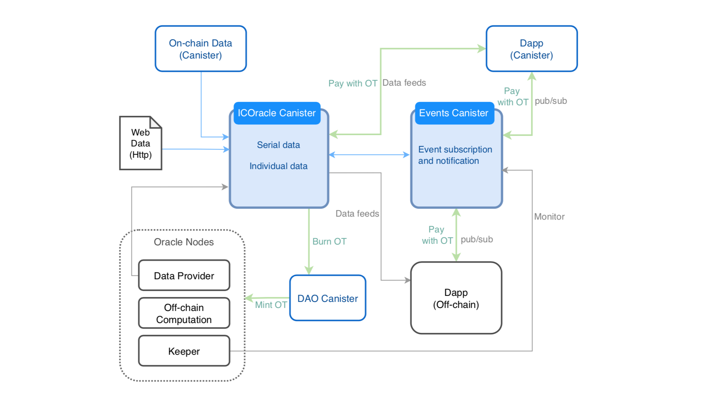
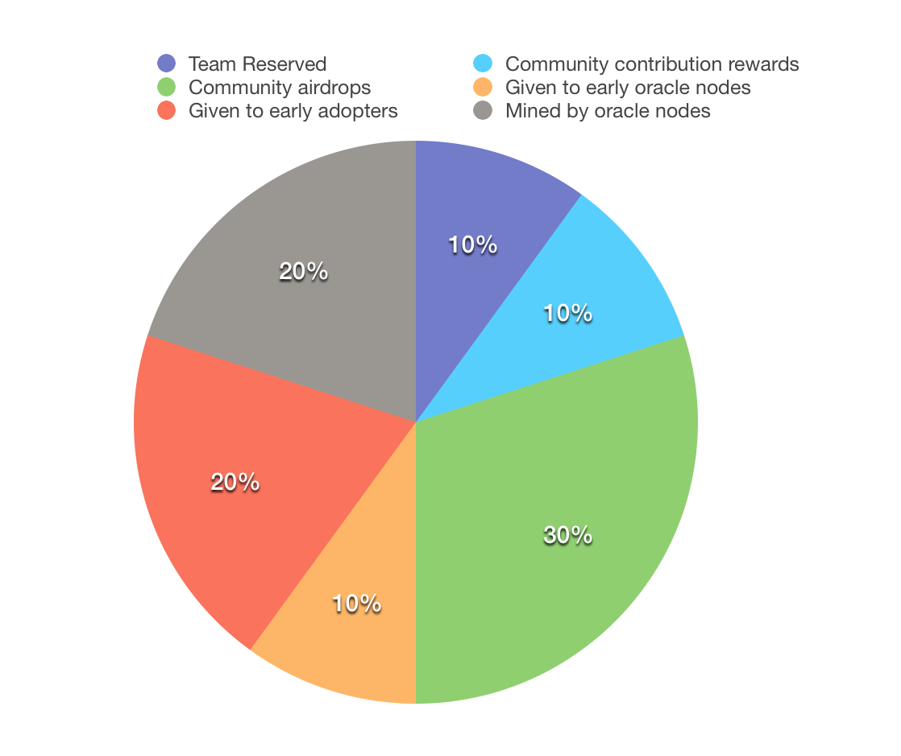
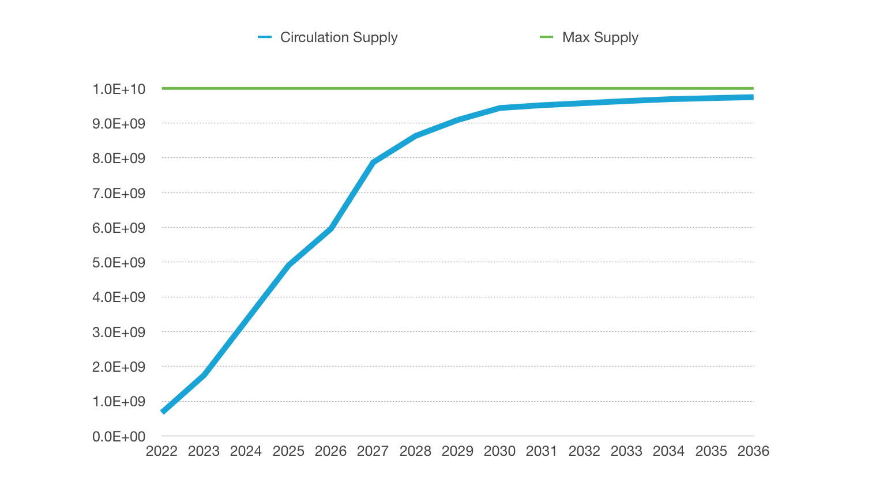

# ICOracle Economic Model

## Token Economic Model

ICOracle Node mine token.
- Applicants are required to stake OTs to the DAO, and the first 21 applicants with the largest staked (and no less than 20,000,000 OTs) qualify as nodes.
- Community users can stake OTs to their trusted node applicants.
- The node's work is mainly to provide data and off-chian calculations to ICOracle Canister, and monitor Events Canister.
- The DAO Canister will share the mining reward pool equally for each period based on the valid workload.

Dapp calls ICOracle data or subscribes to events by paying OTs.
- Canister internal calls to ICOracle Canister require payment of OTs.
- Off-chain applications calling ICOracle Canister with an anonymous account is for free.
- Dapps pay OTs and subscribe to events for ICOracle data to be notified when events occur.

DAO Canister is used to manage proposals and govern the distribution and destruction of tokens.
- Fees received by the ICOracle Canister are destroyed by the DAO Canister.
- An account needs to stake 500,000 OTs to submit a proposal. If the proposal is not approved, 50% of the staked token will be deducted and destroyed.
- Nodes participate in voting with 100 votes per node; if users want to vote directly themselves, they need to stake at least 2,000,000 OTs to participate in voting with 1 vote per account.

Note: Economic model rules may be modified during the project upgrade process prior to the release of the official version.

## Token

ICOracle token OT is the governance and utility token for the ICOracle project.

OT supports [DIP20](https://github.com/Psychedelic/DIP20), [DRC20](https://github.com/iclighthouse/DRC_standards/tree/main/DRC20) and [ICRC1](https://github.com/dfinity/ICRC-1) token standards, using code implemented by [ICTokens](https://github.com/iclighthouse/ICTokens).

**Token Info**

- Canister Id: [imeri-bqaaa-aaaai-qnpla-cai](https://ic.house/token/imeri-bqaaa-aaaai-qnpla-cai)
- Standard: ICRC1, DIP20, DRC20
- Name: ICOracle Token
- Symbol: OT
- Decimals: 8
- Max Supply: 10,000,000,000 OTs

## Token Distribution
**Notes**: 
1) No ICO, No public sale, No private sale.
2) All OTs are distributed through giveaways or mining, including airdrops, node mining, early adopter rewards, community contribution rewards, team reserved.

**Distribution Rules**:
- 10% (1,000,000,000 OTs) - Team Reserved
    - It is locked until 0:00 on 1 January 2024 and then released linearly over 2 years.
- 10% (1,000,000,000 OTs) - Community contribution rewards
    - Quarterly distribution of up to 50,000,000 OTs.
- 30% (3,000,000,000 OTs) - Community airdrops
    - 400,000,000 OTs airdropped to early backers, unlocked at token launch. 
    - 100,000,000 OTs airdropped every quarter through community events, and the undistributed portion will be destroyed.
    - The remaining OTs can be requested for partial destruction through a DAO proposal.
- 10% (1,000,000,000 OTs) - Given to early oracle nodes
    - Staked in contract for 5 years.
- 20% (2,000,000,000 OTs) - Given to early adopters
    - Up to 10,000,000 OTs per project.
    - Quarterly distribution of up to 60,000,000 OTs.
- 20% (2,000,000,000 OTs) - Mined by oracle nodes.
    - Mining supply of 20,000,000 OTs per month, halved every 4 years.

**Circulation Supply (Est.)**:

## Disclaimers

ICOracle protocol is a community-driven decentralised project which is thought to be a community collaboration project, using open technologies and protocols as the backbone of its functionalities.

ICOracle is provided “as is”, and utilized at your own risk and responsibility without warranties.

ICOracle token OT is used for governance and utility only and no team or individual guarantees its value.

Therefore before utilizing this service you should review its documentation and codes carefully to fully understand its functioning and the risks that could entail the usage of a service built on open protocols on an autonomous blockchain network (the Internet Computer).

No individual, entity, developer (internal to the founding team, or from the ICOracle community), or ICOracle itself will be considered liable for any damages or claims related to the usage, interaction, or lack of functioning associated with the ICOracle protocols, its interfaces, or websites. This includes loss of profits, assets of any value, or indirect, incidental, direct, special, exemplary, punitive or consequential damages. The same applies to the usage of ICOracle through third-party interfaces or applications that integrate/surface it. It is your responsibility to manage the risk of your activities and usage on said platforms/protocols.

Utilizing this project/protocol may not comply with the requirements of certain regional laws. You are requested to comply with local laws and to assume all legal consequences arising from its use.

